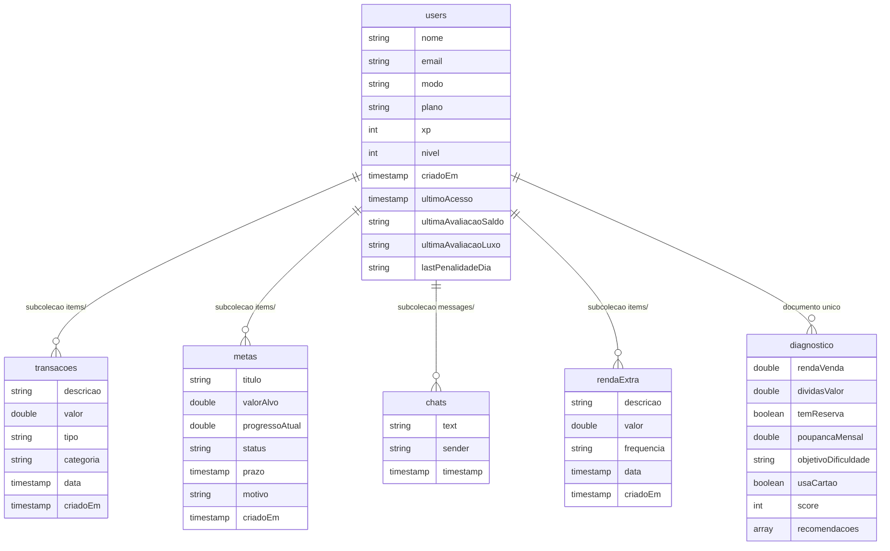
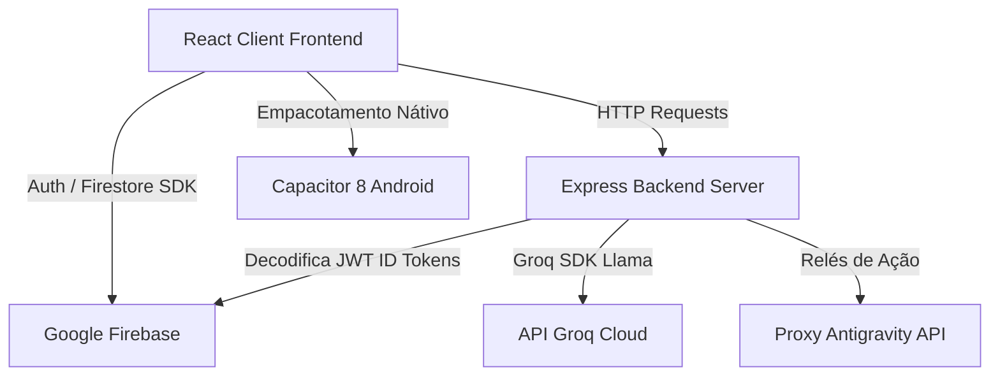

# RESUMO MESTRE — FINANCE AI

## 1. VISÃO GERAL

O **FinanceAI** é uma plataforma avançada de gestão e controle financeiro pessoal e empresarial, que utiliza inteligência artificial e conceitos profundos de gamificação (XP, níveis, bônus e penalidades de orçamento) para engajar e guiar o usuário na melhoria de sua saúde financeira.

### Propósito do Sistema
- Auxiliar o usuário no controle e organização de suas finanças diárias de forma simples e engajadora.
- Classificar extratos bancários de forma automatizada e inteligente via inteligência artificial (reconhecendo entradas, saídas, taxas e categorias ideais).
- Proporcionar um assistente conversacional inteligente que atua em tempo real com base no contexto financeiro real do usuário.
- Oferecer simuladores de cenários de investimento e empréstimo com avaliações de risco geradas por inteligência artificial.
- Emitir diagnósticos de saúde financeira e relatórios customizados em PDF estruturados e exportáveis.

### Público-Alvo
- **Pessoas Físicas (Modo Pessoal)**: Indivíduos que desejam monitorar gastos diários, estipular metas, economizar dinheiro e obter insights imediatos de hábitos de consumo.
- **Pequenos Empreendedores e Autônomos (Modo Empresarial)**: Profissionais que necessitam separar finanças pessoais de corporativas, controlar capital de giro, margens de lucro estimadas e faturamento mensal.

### Estágio Atual do Projeto
- O projeto encontra-se em estágio altamente maduro de desenvolvimento e pronto para uso:
  - **Frontend**: SPA construída em React 19, empacotada com Vite e estilizada com Tailwind CSS. Utiliza transições fluidas e barramentos de progresso gamificados.
  - **Backend**: Servidor Express em Node.js operando localmente via script dedicado e adaptado para rotas serverless na Vercel.
  - **Banco de Dados**: Integrado ao Google Firebase Auth e Firestore, com regras de segurança ativas e isolamento robusto de dados.
  - **Mobile**: Configuração completa do Capacitor 8 pronta para gerar builds nativas Android (`debug` e `release`).

---
> ⚠️ **ATENÇÃO**
> O sistema está totalmente operacional e integrado ao Firebase local/produção. É fundamental que as chaves de ambiente backend (Groq e Firebase Admin) estejam devidamente preenchidas para que a inteligência artificial e as rotas autenticadas funcionem em sua totalidade.
---

## 2. STACK TECNOLÓGICA

O projeto utiliza um conjunto de tecnologias modernas e de alta performance no ecossistema Javascript/TypeScript:

### Frontend
- **React 19.0.1** (Core) & **React DOM 19.0.1**.
- **TypeScript** para tipagem estática e segurança do código.
- **Tailwind CSS v4** para estilização rápida, responsiva e moderna.
- **Vite 6.2.3** como bundler de desenvolvimento e build de alta performance.
- **React Router DOM 7.15.1** para controle de rotas dinâmicas e navegabilidade SPA.
- **Recharts 3.8.1** para renderização de gráficos interativos de receitas vs. despesas.
- **Framer Motion (motion 12.23.24)** para micro-animações, modais e transições dinâmicas.
- **Lucide React 0.546.0** para o pacote visual de ícones.
- **React Hot Toast 2.6.0** para notificações instantâneas no topo da interface.
- **Canvas Confetti & React Confetti** para animações de sucesso (como na subida de nível ou conclusão de metas).

### Backend
- **Node.js** com execução TypeScript assistida por **tsx 4.21.0**.
- **Express 4.21.2** como framework de servidor web e proxy.
- **Esbuild 0.25.0** para compilação rápida do servidor de backend para formato de produção (`dist/server.cjs`).
- **Helmet 8.1.0** para reforço de segurança através da configuração de cabeçalhos HTTP.
- **Express Rate Limit 8.5.2** para conter e limitar requisições excessivas de IA (limite definido em 200 requisições/hora por usuário).
- **Multer 2.1.1** para manuseio e armazenamento de arquivos de extrato em memória temporária.
- **PDF2JSON 4.0.3** e **PDF-parse 1.1.1** para extração bruta de texto de extratos bancários digitais.
- **XLSX (SheetJS) 0.18.5** para leitura de planilhas de transações em Excel.

### Banco de Dados e Storage
- **Google Firebase Firestore**: Banco de dados NoSQL baseado em documentos e subcoleções em tempo real.
- **Google Firebase Authentication**: Controle de logins, cadastros de e-mail/senha e sessões seguras no cliente.
- **Firebase Admin SDK 13.10.0**: Utilizado no backend Express para decodificar e validar os JWT ID Tokens do Firebase.
- ⚠️ **ATENÇÃO (STORAGE)**: O projeto **NÃO** utiliza armazenamento persistente de arquivos físicos na nuvem. Os extratos enviados para classificação são processados em buffer de memória diretamente pela API no backend e convertidos em texto, sem a necessidade de gravação física ou buckets dedicados no Firestore/Storage.

### Integrações Externas
- **Groq SDK 1.2.0**: Conecta com a API Groq para processamento de inteligência artificial de altíssima velocidade.
  - **Llama 3.3 70B (llama-3.3-70b-versatile)**: Utilizado para a classificação analítica de extratos bancários e streaming de conversa do Assistente IA devido à sua alta precisão semântica.
  - **Llama 3.1 8B (llama-3.1-8b-instant)**: Utilizado em tarefas rápidas baseadas em JSON estruturado, como geração de diagnósticos, sugestões inteligentes de metas, simulação de investimentos e execução de alertas.
- **Antigravity Action Proxy**: Roteamento seguro das interações do frontend para a plataforma de desenvolvimento Antigravity `/api/antigravity/action`, ocultando segredos e chaves de API.
- ⚠️ **ATENÇÃO (NÃO PRESENTE)**: Com base em uma busca abrangente em todo o codebase, **NÃO existem quaisquer códigos ou arquivos relacionados a Evolution API, Supabase Storage, ou Railway**. Essas ferramentas são totalmente inexistentes no codebase.

### Mobile
- **Capacitor 8.3.4** (Core, CLI e Android): Bridge moderna para empacotamento da aplicação web como um aplicativo nativo para Android.
- Configuração nativa sob a pasta `/android`, com builds automatizadas via Gradle.

---
> ⚠️ **ATENÇÃO**
> Não existem arquivos relacionados ao Supabase ou Railway no diretório. A persistência de dados ocorre exclusivamente no Firebase Firestore e a hospedagem backend é desenhada para arquitetura Vercel Serverless.
---

## 3. ESTRUTURA DE ARQUIVOS

O repositório apresenta uma estrutura limpa e bem delimitada, separando a lógica cliente da lógica de rotas do servidor Express:

```text
financeai/
└── AppFinance/
    ├── api/
    │   └── index.ts                 # Handler Express serverless para implantação no Vercel API
    ├── src/
    │   ├── components/
    │   │   ├── FinanceChat.tsx      # Widget flutuante de bate-papo de inteligência artificial (todas as telas)
    │   │   ├── NewTransactionModal.tsx # Modal de criação manual de receita/despesa (c/ verificação de XP)
    │   │   ├── OnboardingWizard.tsx # Fluxo de configuração inicial e diagnóstico de saúde financeira
    │   │   ├── ProtectedRoute.tsx   # Wrapper de rota protegida que valida sessões ativas do Firebase
    │   │   └── Simulador.tsx        # Tela de simulações interativas de investimentos/empréstimos via IA
    │   ├── hooks/
    │   │   ├── useAuth.tsx          # Contexto e hook de autenticação e listeners do perfil no Firestore
    │   │   └── usePlan.tsx          # Controle de modais de Upgrade de Plano (Free -> Pro -> Empresarial)
    │   ├── lib/
    │   │   ├── antigravityConfig.ts # Utilitários de requisição para proxy Antigravity
    │   │   ├── firebaseConfig.ts    # Inicialização do Firebase Client SDK
    │   │   ├── gamification.ts      # Catálogo centralizado de XP, níveis e penalidades de orçamento
    │   │   └── seed.ts              # Função auxiliar para popular dados de teste (mocked transactions)
    │   ├── pages/
    │   │   ├── ChatPage.tsx         # Interface completa de chat em tempo real por streaming (SSE)
    │   │   ├── Dashboard.tsx        # Central administrativa com resumos de despesas, receitas e progresso
    │   │   ├── ImportPage.tsx       # Módulo de importação e processamento de arquivos de extrato via IA
    │   │   ├── InvestimentosPage.tsx # Módulo de carteira de investimentos com XP gamificado
    │   │   ├── Login.tsx            # Tela moderna de Autenticação (Login e Cadastro com Firebase)
    │   │   ├── MetasPage.tsx        # Módulo de gerenciamento de objetivos com sugestões dinâmicas da IA
    │   │   ├── NiveisPage.tsx       # Tabela interativa detalhando todas as regras e conquistas de XP
    │   │   └── RendaExtra.tsx       # Módulo para registro e monitoramento de receitas extras diversificadas
    │   ├── App.tsx                  # Definição e roteamento primário via HashRouter
    │   ├── index.css                # Configurações globais de layout e importações Tailwind CSS
    │   └── main.tsx                 # Ponto de entrada de renderização do React
    ├── android/                     # Estrutura nativa Android gerada pelo Capacitor
    ├── Configure security rules     # Cópia sobressalente de regras inseguras temporárias de Firestore
    ├── firestore.rules              # Arquivo de Regras de Segurança de Produção do Firestore
    ├── server.ts                    # Servidor local Express em Node.js (Vite Dev Server & Proxy)
    ├── serverReportGenerator.tsx    # Utilitário backend para compilar e gerar streams de PDF via React-PDF
    ├── capacitor.config.json        # Configuração do Capacitor (AppName: AppFinance)
    ├── tailwind.config.js           # Configurações adicionais de layout Tailwind
    ├── tsconfig.json                # Configurações globais do compilador TypeScript
    └── package.json                 # Definição de pacotes, scripts e metadados da aplicação
```

### Responsabilidade de Cada Arquivo Principal

1. **`api/index.ts`**: Ponto de entrada das funções do servidor quando rodando em ambiente Vercel. Exporta o aplicativo Express para ser consumido como serverless functions.
2. **`server.ts`**: Arquivo de inicialização local. Configura middlewares do Express (Helmet, CORS, Rate Limiters, Multer), monta o servidor Vite local para desenvolvimento e expõe as mesmas rotas de API do backend.
3. **`serverReportGenerator.tsx`**: Compila e desenha as tabelas e folhas de estilo do PDF utilizando `@react-pdf/renderer` para exportação direta de relatórios no servidor.
4. **`firestore.rules`**: Contém as diretrizes estritas do Firestore. Regula a segurança impedindo qualquer usuário não autenticado de ler ou escrever registros e limita os acessos de usuários normais estritamente à sua subcoleção contendo seu `userId`.
5. **`src/App.tsx`**: Centraliza as rotas SPA e injeta os provedores globais de contexto de autenticação (`AuthProvider`) e de planos (`PlanProvider`).
6. **`src/lib/gamification.ts`**: Arquivo crucial com regras puras de gamificação. Define os limiares de XP para cada nível, valores de eventos positivos, penalidades automáticas (despesas recorrentes, inatividade com metas ativas, excessos de gastos em lazer) e cálculo matemático do Score Financeiro.
7. **`src/hooks/useAuth.tsx`**: Trata a persistência da sessão do usuário. Ao detectar novas sessões do Firebase Auth, busca o perfil correspondente na coleção `users` do Firestore e dispara promessas em background para recalcular inatividade e saldos.
8. **`src/hooks/usePlan.tsx`**: Oferece o método `checkAccess(requiredPlan, feature)` que bloqueia o acesso dos usuários a recursos do plano Pro/Empresarial (ex: assistente de IA, simulador) exibindo um modal customizado de Upgrade de Plano que pode ser assinado instantaneamente via Firestore de forma fictícia para testes rápidos.
9. **`src/pages/ImportPage.tsx`**: Permite arrastar extratos bancários nos formatos PDF, CSV, OFX e planilhas Excel. Realiza chamadas com buffers multipart para a API `/api/ia/classificar` e popula a tela com transações prontas para serem inseridas no Firestore.
10. **`src/pages/ChatPage.tsx`**: Interface do assistente de finanças. Conecta-se à rota de streaming via Server-Sent Events (SSE), lendo as mensagens acumuladas em tempo real e atualizando o chat dinamicamente.

---
> ⚠️ **ATENÇÃO**
> A duplicação de diretrizes entre o arquivo `Configure security rules` (aberto e inseguro por 30 dias) e o `firestore.rules` (regras estritas e blindadas) pode induzir a erros. Deve-se adotar prioritariamente as regras do `firestore.rules` na implantação final de produção do Firebase.
---

## 4. MÓDULOS E FUNCIONALIDADES

O FinanceAI é estruturado em módulos independentes que oferecem uma experiência coesa e engajadora:

### A. Fluxo de Autenticação e Registro (`/login`)
- Interface estilizada com modo escuro contendo formulário de login por e-mail e senha.
- Possibilita a criação de novas contas. Ao se cadastrar, o Firebase Auth gera uma credencial de segurança e o hook de autenticação insere automaticamente um documento inicial de perfil na coleção `users` do Firestore (iniciando o usuário no Nível 1 com 0 XP).

### B. Fluxo de Onboarding e Diagnóstico (`/onboarding`)
- Questionário passo a passo dinâmico para novos usuários.
- Coleta dados como nome, renda fixa mensal, despesas estimadas, se possui reserva de emergência, se utiliza cartões de crédito e as principais metas desejadas.
- O questionário envia os inputs ao backend na rota `/api/diagnostico`. O servidor calcula um score matemático básico (0-1000) e utiliza o Groq Llama 3.1 8B para gerar 3 sugestões financeiras personalizadas e curtas.
- Ao salvar as informações, o usuário recebe um bônus de **+30 XP** no banco de dados e é redirecionado para a plataforma.

### C. Dashboard Geral (`/dashboard`)
- Apresenta métricas-chave em tempo real: Saldo Acumulado, Rendas Extras Totais e Despesas Consolidadas do mês atual.
- Inclui gráficos analíticos interativos demonstrando a evolução de receitas vs. despesas.
- Exibe o progresso de XP do usuário na parte superior com confetti animado ao subir de nível.
- Renderiza avisos e alertas inteligentes baseados em anomalias identificadas (ex: excesso de despesas ou aproximação do prazo de metas).

### D. Módulo de Transações (`/transacoes`)
- Tabela interativa para visualização e acompanhamento de transações manuais e importadas.
- Permite a filtragem por tipo (receitas ou despesas) e por categorias customizadas.
- Modais rápidos de criação e edição manual de receitas/despesas.
  - **Lógica Gamificada Integrada**:
    - Ao adicionar manualmente uma receita, o usuário recebe **+10 XP**.
    - Ao adicionar despesas manuais, o sistema valida no Firestore se o usuário já realizou 3 ou mais registros de despesa na data de hoje. Se sim, aplica uma penalidade de **-15 XP** (Excessos desnecessários de consumo) uma única vez por dia.

### E. Módulo de Importação Inteligente (`/importar`)
- Drag and Drop para envio de extratos bancários físicos ou em texto.
- Suporta múltiplos arquivos de texto, PDF, OFX, CSV ou Excel.
- Envia os buffers criptografados ao servidor na rota `/api/ia/classificar`. A inteligência artificial Llama 3.3 70B varre o texto, converte datas para o formato ISO, normaliza valores monetários decimais e classifica cada registro em categorias adequadas.
- O usuário analisa a listagem estruturada gerada e, ao confirmar a importação geral, ganha um bônus de **+20 XP**.

### F. Módulo de Objetivos e Metas (`/metas`)
- Permite estipular objetivos específicos com títulos personalizados, valores a economizar, prazos e motivos associados.
- Ao cadastrar uma meta, o usuário ganha **+15 XP**.
- **Sugestões via IA**: Botão integrado que consome `/api/groq/sugerir-meta` enviando o contexto atual. A inteligência artificial Llama 3.1 8B sugere uma meta financeira curta, alcançável e divertida baseada no perfil.
- Ao atingir o objetivo financeiro e marcar como concluída, o usuário recebe uma animação e um ganho expressivo de **+50 XP**.

### G. Módulo de Renda Extra (`/renda-extra`)
- Tela de inserção e controle de entradas auxiliares (ex: trabalhos freelance, vendas pontuais, dividendos).
- Registros ajudam a recalcular o Score Financeiro global com bônus pela diversificação de receitas.
- Cadastrar a primeira renda extra garante um bônus de **+15 XP**, e rendas extras recorrentes concedem **+20 XP**.

### H. Chat Assistente IA (`/chat`) e Widget Flutuante (`/FinanceChat`)
- Canal direto para interações inteligentes.
- **Streaming por SSE (Server-Sent Events)**: O backend busca em tempo real o histórico e o contexto do usuário (saldo total, despesas por categoria, metas ativas e rendas extras) e monta um prompt restrito que obriga a IA a responder em no máximo duas sentenças objetivas, citando os valores corretos.
- Exclusivo para assinantes a partir do plano Pro (restrição controlada ativamente via `usePlan` hook).

### I. Simulador de Cenários Financiados (`/simulador`)
- Ferramenta interativa de projeção financeira (Ex: compra de imóvel, financiamento de carro, solicitação de empréstimo empresarial).
- O usuário fornece as variáveis (valor total, parcelas, juros, rendimento mensal) e a API calcula os montantes totais pagos.
- O resultado é processado por IA no endpoint `/api/groq/simulador`, retornando um texto analítico de até 3 parágrafos explicando os riscos, a viabilidade técnica da simulação e sugestões práticas de controle de endividamento.

### J. Tabela de Níveis e Regras (`/niveis`)
- Tela explicativa das dinâmicas gamificadas do FinanceAI.
- Exibe o progresso do usuário em tempo real, as regras exatas de ganho/perda de XP, dicas sobre como evitar penalizações e a tabela de níveis (do Nível 1 "Desorganizado" ao Nível 10 "Lenda").

---
> ⚠️ **ATENÇÃO**
> Recursos complexos como o Assistente de Chat por Inteligência Artificial e o Simulador exigem planos de assinatura Pro ou superior. Caso o usuário tente acessá-los no plano Free, a aplicação impedirá o fluxo abrindo o modal de solicitação de upgrade.
---

## 5. BANCO DE DADOS

A plataforma utiliza o **Firebase Firestore** estruturado como um banco NoSQL flexível e veloz.

### Esquema de Coleções e Campos do Firestore



#### 1. Coleção Principal: `users/{userId}`
Contém os dados primários do usuário, suas configurações e controles de avaliação temporal de XP:
- `nome` (string): Nome cadastrado.
- `email` (string): E-mail do usuário.
- `modo` (string): Modo de exibição atual (`pessoal` ou `empresarial`).
- `plano` (string): Plano assinado (`Free`, `Pro` ou `Empresarial`).
- `xp` (number): XP total acumulado (mínimo de 0).
- `nivel` (number): Nível calculado com base no XP (1 a 10).
- `criadoEm` (string ISO): Data de registro original da conta.
- `ultimoAcesso` (string ISO): Data da última atividade/acesso à plataforma.
- `ultimaAvaliacaoSaldo` (string `YYYY-MM`): Impede dupla atribuição mensal do bônus/penalidade de saldo.
- `ultimaAvaliacaoLuxo` (string `YYYY-MM`): Impede dupla penalidade mensal por gastos exorbitantes em lazer.
- `lastPenalidadeDia` (string `YYYY-MM-DD`): Controla e limita a penalidade diária de 3+ despesas registradas em um único dia.

#### 2. Subcoleção: `transacoes/{userId}/items/{docId}`
Registros financeiros individuais do usuário:
- `descricao` (string): Nome ou identificador da despesa/receita.
- `valor` (number): Valor monetário bruto (positivo, absoluto).
- `tipo` (string): Tipo do lançamento (`receita` ou `despesa`).
- `categoria` (string): Classificação da transação (ex: Transporte, Alimentação, Moradia, etc.).
- `data` (string ou Timestamp): Data declarada do fato gerador.
- `criadoEm` (Timestamp): Timestamp automático de persistência no banco de dados.

#### 3. Subcoleção: `metas/{userId}/items/{docId}`
Metas estipuladas e monitoradas:
- `titulo` (string): Título descritivo da meta.
- `valorAlvo` (number): Montante financeiro a ser acumulado.
- `progressoAtual` (number): Valor guardado ou progresso registrado.
- `status` (string): Status operacional da meta (`ativa` ou `concluida`).
- `prazo` (string): Data limite de vencimento.
- `motivo` (string): Frase descritiva de motivação gerada manualmente ou por IA.
- `criadoEm` (Timestamp): Data de criação da meta.

#### 4. Subcoleção: `chats/{userId}/messages/{docId}`
Histórico de mensagens de chat interativas:
- `text` (string): Conteúdo textual enviado ou recebido.
- `sender` (string): Identificador do remetente (`user` ou `ai`).
- `timestamp` (Timestamp): Horário do envio.

#### 5. Subcoleção: `rendaExtra/{userId}/items/{docId}`
Registros auxiliares de entradas monetárias:
- `descricao` (string): Identificador da fonte extra.
- `valor` (number): Valor monetário.
- `frequencia` (string): Periodicidade (`unica` ou `recorrente`).
- `data` (string ou Timestamp): Data associada.
- `criadoEm` (Timestamp): Data de persistência.

#### 6. Documento Único: `diagnostico/{userId}`
Respostas consolidadas e score obtido no questionário inicial:
- Armazena as variáveis enviadas na etapa de Onboarding (renda, dívidas, reserva, poupança) mais o `score` final atribuído e o array de `recomendacoes` gerado pelo Groq Llama.

#### 7. Subcoleção: `investimentos/{userId}/items/{docId}`
Carteira de ativos financeiros do usuário:
- `tipo` (string): Classe do ativo (`Ações`, `FII`, `Tesouro IPCA+`, `Tesouro Selic`, `CDB`, `LCI/LCA`, `Cripto`, `Outro`).
- `ticker` (string): Código ou nome do ativo em maiúsculas (ex: `PETR4`, `MXRF11`, `BTC`).
- `quantidade` (number): Quantidade de unidades/cotas adquiridas.
- `precoMedio` (number): Preço médio de compra por unidade.
- `dataCompra` (string `YYYY-MM-DD`): Data da compra.
- `criadoEm` (string ISO): Timestamp de criação do registro.

#### 8. Subcoleção: `metasInvestimento/{userId}/items/{docId}`
Metas específicas de investimento (independentes das metas financeiras):
- `titulo` (string): Nome da meta de investimento
- `descricao` (string): Detalhamento opcional
- `status` (string): `ativa` ou `concluida`
- `criadoEm` (Timestamp): Data de criação

#### 9. Subcoleção: `proventosInvestimento/{userId}/items/{docId}`
Histórico de dividendos e proventos recebidos:
- `mes` (string `YYYY-MM`): Mês de competência do provento
- `valor` (number): Valor recebido em R$
- `criadoEm` (Timestamp): Data de registro

### Relacionamentos e Isolamento de Dados (Multitenancy)
Sendo um banco de dados NoSQL baseado em documentos, o Firestore não aplica chaves estrangeiras rígidas relacionais. Em contrapartida, adota um modelo hierárquico aninhado por subcoleções dinâmicas estruturadas diretamente sob a chave identificadora `userId`.

#### Regras de Isolamento Multi-tenant (company_id)
- **IMPORTANTE**: O projeto **NÃO utiliza o campo `company_id`** em suas coleções e não possui tabelas SQL tradicionais corporativas.
- O isolamento multi-tenant é implementado de forma segura e elegante com base no **User ID (UID)** gerado pelo Firebase Authentication.
- As regras estritas de segurança em `firestore.rules` operam como barreiras lógicas na camada de banco de dados, avaliando a assinatura criptográfica dos tokens JWT das requisições e assegurando o isolamento de dados:
  ```javascript
  match /transacoes/{userId}/items/{document=**} {
    allow read, write: if request.auth != null && request.auth.uid == userId;
  }
  ```
  Isso garante que um usuário autenticado só possa visualizar, editar ou remover registros cujo caminho possua explicitamente seu próprio ID de usuário correspondente, impossibilitando acessos transversais de outros tenants.

---
> ⚠️ **ATENÇÃO**
> A ausência de regras rígidas de relacionamento relacional no Firestore impõe que toda a validação de integridade referencial dos ID de usuário seja controlada diretamente pela aplicação no frontend e backend, garantindo que consultas nunca omitam a filtragem baseada no `userId`.
---

## 6. INTEGRAÇÕES EXTERNAS

O ecossistema do FinanceAI funciona integrado a parceiros externos cruciais para oferecer inteligência, autenticação segura e recursos nativos:



### 1. Google Firebase
- **Autenticação**: Gerenciamento de e-mails, senhas e chaves de sessão diretamente no navegador do cliente sem persistência local de credenciais sensíveis.
- **Banco de Dados (Firestore)**: Sincronização offline e consultas de baixa latência em subcoleções.
- **Firebase Admin SDK (Servidor)**: Middleware de segurança que valida os cabeçalhos de autorização (`Bearer Token`) do servidor backend, descriptografando o token do Firebase e injetando as propriedades do usuário logado na requisição Express.

### 2. Groq AI Engine (Llama Models)
- Integração profunda no servidor Express, distribuindo requisições inteligentes dependendo do nível de precisão de dados exigido:
  - **Classificador de Extratos (`/api/ia/classificar`)**: Executa o modelo **llama-3.3-70b-versatile** com parâmetros rígidos de temperatura baixa (0.2) e formato estruturado JSON. A inteligência artificial atua interpretando transações bancárias complexas, taxas redundantes e formatos mistos brasileiros, identificando e listando datas e descrições higienizadas.
  - **Bate-papo de Finanças (`/api/groq/chat`)**: Utiliza o modelo **llama-3.3-70b-versatile** configurado sob um prompt de sistema estrito de duas sentenças. O servidor busca os saldos, categorias de despesa, metas e registros extras do Firestore e alimenta o contexto da IA a cada envio de mensagem por Server-Sent Events (SSE).
  - **Diagnosticador de Saúde (`/api/diagnostico`)**, **Simulador de Investimentos (`/api/groq/simulador`)**, **Sugeridor de Metas (`/api/groq/sugerir-meta`)** e **Processamento de Alertas (`/api/cron/alertas`)**: Executam o modelo ágil **llama-3.1-8b-instant** para garantir baixa latência nas respostas interativas JSON da interface.

### 3. Plataforma Antigravity Developer Proxy
- Canal de comunicação frontend/servidor que estabelece o redirecionamento de eventos e ações seguras via Express, encapsulando segredos como a `ANTIGRAVITY_API_KEY` apenas no servidor.

### 4. Vercel Serverless
- Configuração de implantação sob arquitetura orientada a eventos. O arquivo `/api/index.ts` centraliza as rotas em formato Express que são compiladas como rotas serverless independentes na plataforma Vercel.

---
> ⚠️ **ATENÇÃO (MUITO IMPORTANTE)**
> - **NÃO EXISTE Evolution API no codebase**: Nenhuma rota ou controller de envio/recebimento de WhatsApp está configurada.
> - **NÃO EXISTE Supabase Storage no codebase**: Não há buckets, políticas de segurança ou APIs do Supabase mapeadas. Os PDFs carregados não são persistidos fisicamente na nuvem, apenas lidos sob buffers voláteis em memória Node.js.
> - **NÃO EXISTE deploy ativo no Railway**: O deploy do backend foi estruturado para ser embutido na arquitetura de Serverless Functions da Vercel ou executado localmente via Node.js.
---

## 7. AUTENTICAÇÃO E SEGURANÇA

A segurança do FinanceAI foi estruturada sob múltiplos aspectos visando resguardar a privacidade dos dados financeiros e evitar vazamentos de chaves de API:

### A. Autenticação Baseada em Tokens (JWT) no Backend
- Todas as rotas críticas do backend Express (`/api/relatorio`, `/api/ia/classificar`, `/api/groq/chat`, `/api/groq/sugerir-meta`, `/api/groq/simulador`, `/api/antigravity/action`) exigem tokens de segurança nos cabeçalhos HTTP através do middleware `requireAuth`.
- O cliente extrai o token dinâmico por meio do Firebase SDK (`auth.currentUser?.getIdToken()`) e insere-o no cabeçalho `Authorization: Bearer <TOKEN>`.
- O servidor Express valida a assinatura desse token utilizando o Firebase Admin SDK (`admin.auth().verifyIdToken()`).

### B. Fallback de Desenvolvimento local
- Para viabilizar testes offline ou locais ágeis sem configuração imediata do Firebase Service Account no arquivo `.env`, o middleware implementa uma regra de fallback inteligente: se o Firebase Admin não estiver inicializado (`admin.apps.length === 0`), a requisição recebe um ID fictício (`mock_dev_uid`), liberando os fluxos locais de desenvolvimento.

### C. Rate Limiting de Chamadas de IA
- Para mitigar ataques de negação de serviço (DoS) e evitar esgotamento dos limites de requisição das chaves Groq API, o backend implementa o middleware de limitação de tráfego `aiLimiter`:
  ```javascript
  const aiLimiter = rateLimit({
    windowMs: 60 * 60 * 1000, // Janela de 1 hora
    max: 200,                  // Limite de 200 requisições
    message: { error: 'Limite de requisições de IA atingido. Faça upgrade do plano.' }
  });
  ```
- Este limite é aplicado de forma global nas rotas críticas de inteligência artificial (`/api/ia/classificar`, `/api/groq/chat` e `/api/antigravity/action`).

### D. Cabeçalhos de Segurança HTTP (Helmet)
- Em ambientes produtivos, o middleware Helmet é ativado com políticas de segurança restritivas de Content Security Policy (CSP), desabilitando carregamentos externos de scripts e bloqueando injeções maliciosas na aplicação cliente:
  ```javascript
  app.use(helmet({
    contentSecurityPolicy: process.env.NODE_ENV === 'production' ? {
      directives: {
        defaultSrc: ["'self'"],
        scriptSrc: ["'self'", "'unsafe-inline'"],
        styleSrc: ["'self'", "'unsafe-inline'", "https://fonts.googleapis.com"],
        fontSrc: ["'self'", "https://fonts.gstatic.com"],
        imgSrc: ["'self'", "data:", "https://*"],
        connectSrc: ["'self'", "https://*"],
      }
    } : false
  }));
  ```

---
> ⚠️ **ATENÇÃO**
> O fallback que atribui o token fictício `mock_dev_uid` quando o Firebase Admin SDK não está devidamente configurado deve ser **desativado obrigatoriamente** em ambientes produtivos para evitar fraudes ou acessos não autorizados por bypass de autenticação.
---

## 8. REGRAS DE NEGÓCIO

Toda a dinâmica comportamental do aplicativo é regida por regras rígidas de gamificação e gestão contidas no arquivo `src/lib/gamification.ts`:

### A. Tabela Geral de Níveis e XP

O progresso do usuário é distribuído em **10 Níveis de Proficiência**:

| Nível | Título | Mínimo de XP | Cor Visual Recomendada |
| :---: | :--- | :---: | :--- |
| **1** | Desorganizado | 0 XP | Cinza (`text-gray-500`) |
| **2** | Consciente | 100 XP | Azul (`text-blue-500`) |
| **3** | Planejador | 300 XP | Índigo (`text-indigo-500`) |
| **4** | Estrategista | 600 XP | Roxo (`text-purple-500`) |
| **5** | Investidor | 1.000 XP | Laranja (`text-orange-500`) |
| **6** | Independente | 1.500 XP | Amarelo (`text-yellow-500`) |
| **7** | Visionário | 2.100 XP | Esmeralda (`text-emerald-500`) |
| **8** | Mestre Financeiro | 2.800 XP | Ciano (`text-cyan-500`) |
| **9** | Magnata | 3.600 XP | Rosa (`text-rose-500`) |
| **10**| Lenda | 4.500 XP | Âmbar (`text-amber-500`) |

### B. Eventos Positivos (Ganhos de XP)
- **Importar Extrato**: **+20 XP** por extrato importado.
- **Cadastrar Nova Meta**: **+15 XP** ao registrar um novo objetivo.
- **Meta Concluída**: **+50 XP** ao finalizar uma meta.
- **Adicionar Receita**: **+10 XP** ao cadastrar manualmente uma entrada.
- **Diagnóstico Inicial**: **+30 XP** ao finalizar a etapa de Onboarding.
- **Saldo Positivo no Mês**: **+25 XP** por fechar o acumulado mensal acima de zero.
- **Renda Extra Única**: **+15 XP** ao cadastrar a primeira renda extra.
- **Renda Extra Recorrente**: **+20 XP** ao cadastrar fluxos regulares de renda extra.

### C. Penalidades Financeiras (Perdas de XP)
- O XP mínimo é **zero**; o usuário perde XP acumulado, mas nunca fica com pontuação negativa.
- **Excesso de Despesas no Dia**: **-15 XP**. Aplicado se o usuário registrar 3 ou mais despesas manuais no mesmo dia. Limitado a uma aplicação diária registrada no campo `lastPenalidadeDia`.
- **Saldo Negativo no Mês**: **-20 XP**. Aplicado se o fechamento mensal indicar mais despesas que receitas.
- **Excesso de Luxo**: **-10 XP**. Aplicado se a soma de despesas nas categorias `Lazer` e `Assinatura` superar 40% da renda total declarada pelo usuário no mês.
- **Inatividade com Metas Ativas**: **-5 XP**. Aplicado se o usuário permanecer sem acessar o aplicativo por 7 dias ou mais possuindo metas ativas pendentes.

### D. Métricas de Score Financeiro
- O Score Financeiro do usuário é dinâmico e calculado com base na taxa de comprometimento de despesas sobre receitas totais (Renda Fixa + Renda Extra):
  - **Até 50% de comprometimento e saldo positivo**: Score Base = **85** ("Ótimo").
  - **Até 70% de comprometimento e saldo positivo**: Score Base = **65** ("Bom").
  - **Até 90% de comprometimento**: Score Base = **45** ("Regular").
  - **Acima de 90%**: Score Base = **25** ("Crítico").
- **Bônus de Diversificação**: Usuários que possuem mais de uma fonte de renda extra ativa recebem um bônus de **+10 pontos** adicionados diretamente ao Score Financeiro (limitado a 100 pontos de teto máximo).

---
> ⚠️ **ATENÇÃO**
> - **NÃO EXISTE Whatsapp Flow no codebase**: O envio, recebimento, transferência ou automação por WhatsApp não existe no código.
> - **NÃO EXISTE Funil de Vendas**: Não há painéis de funil de vendas, etapas de pipeline de lead ou conexões CRM no código deste projeto.
---

## 9. FLUXO DO WHATSAPP

⚠️ **NOTA CRÍTICA DE ESCOPO (NÃO IMPLEMENTADO / TOTALMENTE AUSENTE DO CÓDIGO)**

Conforme as diretrizes restritas de fidelidade ao codebase real analisado, o aplicativo **FinanceAI NÃO possui fluxos de WhatsApp integrados**:

- **Envio de Mídias/Textos**: Totalmente inexistente. Não há envio automático ou manual de textos, áudios, imagens ou arquivos PDF via WhatsApp.
- **Recebimento via Webhook**: Inexistente. Não existem endpoints configurados no servidor Express voltados para capturar payloads de mensagens recebidas de redes de mensageria externa.
- **Upload de Mídias para Storage**: Ausente. Não há processamento ou upload de mídias enviadas por chat WhatsApp e, por conseguinte, nenhum campo como `media_url` ou indicativos de envio pelo usuário (`from_me` como `true` ou `false`) está implementado ou previsto no banco de dados Firestore.
- **Instâncias Configuradas**: Não há instâncias de Evolution API configuradas no backend ou no frontend.

---
> ⚠️ **ATENÇÃO**
> Caso o usuário precise de fluxos automáticos de lembretes ou extratos por WhatsApp, essa funcionalidade precisará ser desenvolvida do zero, pois é inexistente nas bibliotecas e rotas atuais do codebase.
---

## 10. BUILD E DEPLOY

O fluxo de build e deploy da aplicação separa a distribuição estática do cliente da execução de servidores backend:

### A. Deploy Frontend e Servidor na Vercel
- O projeto foi projetado para rodar na infraestrutura da Vercel:
  - O frontend é compilado na pasta estática `/dist` através do Vite via `vite build`.
  - A API (/api/*) roda sobre rotas serverless orquestradas pelo Express no arquivo `/api/index.ts`.
  - As diretivas de roteamento de arquivos e mapeamento estático são lidas e aplicadas pela Vercel de maneira nativa.

### B. Scripts de Build no `package.json`
- `npm run dev`: Executa localmente o servidor de desenvolvimento Express e o Vite (`tsx server.ts`).
- `npm run build`:
  1. Executa a compilação estática do React Client (`vite build`).
  2. Compila e agrupa o arquivo de servidor `server.ts` utilizando o `esbuild` para gerar o bundle em arquivo único do CommonJS localizado em `dist/server.cjs`.
- `npm run start`: Executa localmente o backend final de produção já compilado (`node dist/server.cjs`).
- `npm run clean`: Remove artefatos temporários e pastas de build antigas (`dist/`).

### C. Empacotamento Mobile (Android via Capacitor)
A aplicação está configurada para build nativa Android e fornece comandos automatizados integrando o Vite ao Capacitor CLI:
- `npm run build:android`: Define a variável de ambiente `CAPACITOR=true`, compila a aplicação com o Vite, atualiza os arquivos nativos do Android via `npx cap sync android` e abre a IDE Android Studio (`npx cap open android`).
- `npm run build:apk:debug`: Compila e gera o pacote APK para testes em ambiente de depuração executando de forma automatizada o Gradle no repositório nativo do Android (`gradlew assembleDebug`).
- `npm run build:apk:release`: Compila e gera o pacote APK assinado de produção para submissão à Google Play Store utilizando o Gradle (`gradlew assembleRelease`).

---
> ⚠️ **ATENÇÃO**
> Durante o build mobile (`CAPACITOR=true`), é vital atentar para que as requisições HTTPS para a API local apontem para o host de rede correto do servidor de backend (e não para `localhost`), caso contrário o emulador Android falhará em conectar-se às rotas de IA e autenticação.
---

## 11. PROBLEMAS RESOLVIDOS

Nesta seção, consolidamos as melhorias e correções arquiteturais documentadas no histórico recente do repositório:

1. **Segurança de Endpoints no Backend**: Substituição do mock irrestrito nas rotas pelo uso obrigatório do middleware `requireAuth`, que valida ativamente os tokens JWT do Firebase Authentication no backend.
2. **Prevenção de Abuso de Cota de IA**: Implementação do middleware de controle de tráfego `aiLimiter` no Express, mitigando gastos excessivos de infraestrutura ao barrar acessos acima de 200 chamadas/hora em rotas da Groq.
3. **Robustez na Extração de Extratos (Absolute Values)**: Ajuste fino no parser inteligente de PDFs para converter strings decimais complexas brasileiras (ex: 1.860,32 com sinal negativo `-`) em valores matemáticos float absolutos e positivos no campo de valor, ajustando a detecção e inserção de transações no banco de dados.
4. **Isolamento de Credenciais Confidenciais**: Migração da chamada da plataforma Antigravity (que expunha a chave secreta diretamente no cliente do navegador) para uma rota proxy segura no backend (`/api/antigravity/action`), resguardando as chaves confidenciais apenas em variáveis de ambiente protegidas no servidor.
5. **[2026-05-25] Auditoria BLOCO 1 — Correção dos Downloads de PDF**:
   - **`server.ts` e `api/index.ts`**: Corrigido o header `Content-Disposition` na rota `/api/relatorio`. O nome do arquivo estava sem aspas obrigatórias conforme RFC 6266 (`filename=relatorio.pdf`) e foi ajustado para o formato correto com aspas e nome padronizado (`filename="relatorio-financeai.pdf"`).
   - **`src/components/Dashboard.tsx`**: Adicionado `window.URL.revokeObjectURL(url)` após o clique no link de download do relatório PDF, prevenindo memory leak de objetos Blob no navegador.
   - **`src/pages/DemonstrativosPage.tsx`**: Adicionado `window.URL.revokeObjectURL(url)` após o clique no link de download do PDF da DRE, prevenindo memory leak de objetos Blob no navegador.
   - **`src/pages/RescisaoPage.tsx`**: Auditado — já estava correto com `URL.revokeObjectURL` e `document.body.removeChild(a)`. Nenhuma alteração necessária.
   - **Backend — rota `/api/relatorio`**: Auditado — já possui `requireAuth`, headers `Content-Type: application/pdf` e `Content-Disposition` corretos (após correção), e `try/catch` com `res.status(500).json()`.
   - **Frontend — todas as funções de download**: Auditado — token Firebase enviado via `Authorization: Bearer <token>` em todos os pontos. Blobs criados corretamente com tipo MIME adequado. Elemento `<a>` removido do DOM em todos os pontos. Toast de erro visível ao usuário via `react-hot-toast` presente em todos os pontos.
6. **[2026-05-25] Auditoria BLOCO 2 — Integração com Firebase**:
   - Mapeadas todas as operações de leitura e escrita nas coleções (`users`, `transacoes`, `metas`, `chats`, `rendaExtra`, `diagnostico`). 
   - Confirmado que todas as requisições estão passando o `userId` dinâmico originado pelo hook `useAuth`/`auth.currentUser` — não há IDs hardcoded.
   - Confirmado que os campos e tipos escritos correspondem rigorosamente ao esquema (ex: `valorAlvo` para metas).
   - **Correção em `firestore.rules`**: Identificado que a coleção `funcionarios/{userId}/items` estava sendo manipulada sem a devida blindagem de segurança no servidor do Firebase. Uma nova regra (`allow read, write: if request.auth != null && request.auth.uid == userId;`) foi criada para proteger a entidade, isolando os tenants da empresa.
7. **[2026-05-25] Funcionalidade BLOCO 3 — Exclusão de Funcionário**:
   - **`FuncionariosPage.tsx`**: Implementada a deleção de funcionários diretamente no cliente Firebase via `deleteDoc` na coleção respectiva (`funcionarios/{userId}/items/{id}`). 
   - Adicionada interface inline de confirmação de exclusão nos cards da equipe (substituindo modais intrusivos como `window.confirm`), com ícone de `Trash2`, tratamento de estados de progresso (spinner durante deleção), atualização em tempo real do estado na tela (removendo o funcionário da renderização sem refresh da página), e notificações assíncronas via `react-hot-toast`.
8. **[2026-05-25] Auditoria BLOCO 4 — Valores de Contratação PJ**:
   - **`FuncionariosPage.tsx`**: O sistema calculava e somava incorretamente encargos trabalhistas (INSS Patronal de 20%, FGTS de 8%, RAT/SAT de 2%, Férias e 13º) para funcionários do tipo `PJ`. A lógica da função `calcularCustos` foi reescrita para aceitar o `tipoContrato`.
   - Implementada a fórmula de retenção de impostos exclusiva para PJ: `Valor bruto do contrato = valor líquido desejado / (1 - (Simples Nacional 6% + ISS 5%))`, eliminando qualquer alíquota equivocada de 15,5% ou encargos de CLT.
   - A aba "Custo Real" foi dinamicamente atualizada para exibir o demonstrativo de NF para PJ (Valor Líquido, Simples Nacional 6%, ISS 5% e Custo Total da Empresa).
   - Confirmada a aplicação unificada do formatador Monetário `Intl.NumberFormat('pt-BR', { style: 'currency', currency: 'BRL' })` para os valores de PJ.
9. **[2026-05-25] Funcionalidade BLOCO 1 e 2 — Scroll Fixo e Carteira Financeira**:
   - **Scroll Lateral Independente**: Aplicado o modelo de layout `h-screen overflow-hidden` global na raiz das páginas, com `.scroll-smooth overflow-y-auto h-full` aplicado separadamente na Sidebar esquerda e no `<main>`, impedindo o scroll do `body` (refatorado o `index.css`). O painel lateral agora se mantém perfeitamente estático e o conteúdo central rola independentemente.
   - **Modal de Transações (`NewTransactionModal.tsx`)**: Implementados 3 novos campos condicionais ("Origem do Valor"): `cartaoVinculado` (apenas para despesas), `dinheiroCarteira` e `bancoOrigem` (com `<datalist>` nativo de sugestões de bancos). Valores vazios são suprimidos no `addDoc` (Firestore) para otimizar espaço de armazenamento.

---
> ⚠️ **ATENÇÃO**
> Assegure que as bibliotecas e dependências externas instaladas no servidor estejam sempre atualizadas para coibir brechas conhecidas nas bibliotecas de leitura de arquivos PDF (como o pdf-parse).
---

## 12. DÉBITOS TÉCNICOS

Identificamos os seguintes pontos de atenção arquitetural e débitos técnicos remanescentes no codebase:

1. **Bypass de Autenticação (`mock_dev_uid`)**: O fallback para `mock_dev_uid` quando as chaves de serviço Firebase Admin estão ausentes facilita o desenvolvimento ágil, mas constitui um risco elevado caso ativado por engano em ambientes de produção.
2. **Volatilidade de Arquivos Importados (Sem Persistência de Mídia)**: Os arquivos de extrato físico submetidos não são salvos em nenhum repositório físico na nuvem (Storage). Caso ocorra uma falha de conexão da IA no processamento, o usuário perde o arquivo em memória e precisa carregá-lo novamente do zero.
3. **Ausência de Integração Real com Banco no Upgrade**: O upgrade de plano é simulado atualizando o campo `plano` no Firestore diretamente via UI de forma fictícia. Em produção, este fluxo necessita de integração segura a um gateway de pagamentos real (Stripe, Asaas, etc.).
4. **Duplicidade de Regras de Segurança**: O arquivo `Configure security rules` contém regras temporárias frágeis que expiram em 30 dias, enquanto o `firestore.rules` apresenta a lógica estrita de produção. Isso pode confundir desenvolvedores no momento do deploy de segurança.

---
> ⚠️ **ATENÇÃO**
> A ausência de um mecanismo de auditoria automatizado para monitorar logs de bypass de segurança no backend com o `mock_dev_uid` expõe a aplicação a vazamentos se a configuração de ambiente for corrompida.
---

## 13. BACKLOG E MELHORIAS SUGERIDAS

Recomendamos as seguintes implementações estratégicas para futuras iterações e melhoria contínua da plataforma:

1. **Persistência de Mídia Segura**: Implementar integração ao Firebase Storage para arquivamento seguro dos extratos físicos enviados, permitindo auditorias financeiras futuras dos PDFs e planilhas inseridos.
2. **Notificações Push Reais**: Adicionar a dependência `@capacitor/push-notifications` e configurar o Firebase Cloud Messaging (FCM) para emitir alertas e avisos nativos em dispositivos Android quando o usuário sofrer penalidades de orçamento ou se aproximar do prazo de conclusão de metas.
3. **Gateway de Pagamento Integrado**: Mapear webhooks e APIs para gerenciar faturamentos, cobranças de mensalidade e transição automatizada de planos Pro/Empresarial.
4. **Multi-usuários e Contabilidade**: Implementar a funcionalidade descrita no plano Empresarial que permite acesso restrito para contadores e gestão de múltiplos perfis integrados sob a mesma empresa cadastrada no Firestore.
5. **Automação de Testes de UI**: Adicionar frameworks de testes visuais automatizados (como Cypress ou Playwright) para mitigar falhas em fluxos críticos como Onboarding e Importações Inteligentes de extrato.

---
> ⚠️ **ATENÇÃO**
> Toda nova feature contendo IA que for implementada deve passar rigorosamente pelo fluxo de validação de plano atrelado ao `usePlan` hook, de modo a evitar brechas na monetização de recursos Pro/Empresarial da plataforma.
---

## 14. VARIÁVEIS DE AMBIENTE

Para a correta execução local e em produção da plataforma, certifique-se de configurar os seguintes arquivos e variáveis:

### A. Variáveis do Frontend (`AppFinance/.env` ou Variáveis de Compilação Vite)
Essas variáveis alimentam a conexão com os serviços do Google Firebase no cliente e precisam obrigatoriamente iniciar com o prefixo `VITE_`:
- `VITE_FIREBASE_API_KEY`: Chave de API pública do Firebase Client.
- `VITE_FIREBASE_AUTH_DOMAIN`: Domínio de autenticação associado ao projeto.
- `VITE_FIREBASE_PROJECT_ID`: Identificador único do projeto Firebase.
- `VITE_FIREBASE_STORAGE_BUCKET`: Caminho do bucket de armazenamento (caso habilitado).
- `VITE_FIREBASE_MESSAGING_SENDER_ID`: ID do remetente para configurações de notificação.
- `VITE_FIREBASE_APP_ID`: Identificador de aplicação exclusivo gerado pelo Firebase.

### B. Variáveis do Servidor Backend (`AppFinance/.env` ou Servidor Vercel)
Esses tokens e segredos são estritamente confidenciais e residem apenas no lado do servidor, nunca expostos ao código do navegador cliente:
- `GROQ_API_KEY`: Chave secreta de autenticação e consumo de inteligência artificial na Groq Cloud.
- `FIREBASE_SERVICE_ACCOUNT_JSON`: String compactada do JSON da conta de serviço gerada no painel Firebase, necessária para autorizar o Firebase Admin SDK a ler e escrever dados dinamicamente.
- `ANTIGRAVITY_API_URL`: Rota da API base da plataforma Antigravity (ex: `https://api.antigravity.dev/v1`).
- `ANTIGRAVITY_API_KEY`: Token Bearer de acesso secreto de desenvolvedor à API Antigravity.
- `PORT` (Opcional): Porta local de execução do servidor Express (padrão `3000`).

---
> ⚠️ **ATENÇÃO**
> Nunca envie ou comite os arquivos `.env` ou arquivos contendo as chaves de serviço JSON do Firebase para repositórios públicos do GitHub/Gitlab, pois isso compromete totalmente as chaves confidenciais do servidor e permite fraudes.
---

## 15. HISTÓRICO DE ALTERAÇÕES

| Data/Hora | O que foi feito | Arquivos Modificados |
|---|---|---|
| 2026-05-25 12:25 (BRT) | **Auditoria BLOCO 1**: Corrigido header `Content-Disposition` (aspas RFC 6266) em ambos os servidores; adicionado `URL.revokeObjectURL` em Dashboard e DemonstrativosPage para prevenir memory leak; auditoria completa de todos os pontos de download do projeto confirmou conformidade de autenticação, MIME type, remoção de DOM e toast de erro. | `server.ts`, `api/index.ts`, `src/components/Dashboard.tsx`, `src/pages/DemonstrativosPage.tsx` |
| 2026-05-25 12:35 (BRT) | **Auditoria BLOCO 2 e Feature BLOCO 3**: Auditoria Firebase concluída, `firestore.rules` atualizado para proteger a coleção `funcionarios`. Implementada a exclusão de funcionário no Frontend (`FuncionariosPage.tsx`) com interface de confirmação inline, chamadas `deleteDoc` assíncronas e notificações `react-hot-toast`. | `firestore.rules`, `src/pages/FuncionariosPage.tsx`, `RESUMO_MESTRE.md` |
| 2026-05-25 12:40 (BRT) | **Auditoria BLOCO 4**: Corrigidos cálculos de custos reais para contratações PJ. Encargos CLT (INSS Patronal, FGTS, etc) foram removidos e substituídos pela fórmula de Valor Bruto usando alíquotas fixas (Simples 6% e ISS 5%). Tabelas visuais adaptadas para exibir o desdobramento da NFS-e. | `src/pages/FuncionariosPage.tsx`, `RESUMO_MESTRE.md` |
| 2026-05-25 12:59 (BRT) | **Feature BLOCO 1 e 2**: Implementado Scroll Independente global com Tailwind (h-screen root, aside e main h-full com overflow-y-auto, modificação global no `index.css`). Inserida Seção Origem do Valor (`cartaoVinculado`, `dinheiroCarteira`, `bancoOrigem`) no Modal de Transações com datalist nativo. | `index.css`, `fix_layout.cjs` (TODAS páginas refatoradas), `src/components/NewTransactionModal.tsx` |
| 2026-05-27 10:07 (BRT) | **PROMPT 1 — Página de Investimentos**: Criada `InvestimentosPage.tsx` com formulário de cadastro de ativos (tipo, ticker, quantidade, precoMedio, dataCompra), tabela de ativos com exclusão, card de resumo (total investido, distribuição por tipo), persistência no Firestore em `investimentos/{userId}/items`, XP de +20 ao adicionar o primeiro ativo. Rota `/investimentos` registrada no `App.tsx` com `ProtectedRoute`. Item "Investimentos" com ícone `BarChart2` adicionado ao menu lateral do `Dashboard.tsx`. | `src/pages/InvestimentosPage.tsx` (NOVO), `src/App.tsx`, `src/pages/Dashboard.tsx`, `firestore.rules` |
| 2026-05-27 10:07 (BRT) | **PROMPT 2 — Scroll lateral independente da sidebar**: Adicionadas classes `overflow-y-auto` e `h-full` ao elemento `<aside>` do `Dashboard.tsx`. O container raiz já possuía `h-screen overflow-hidden flex` e o `<main>` já tinha `overflow-y-auto h-full`, completando o layout de scroll independente. | `src/pages/Dashboard.tsx` |
| 2026-05-27 10:12 (BRT) | **PROMPT 3 — Correção de Download de PDF**: Padronizados todos os downloads de PDF no ecossistema FinanceAI. Corrigidas as chamadas de fetch para `/api/relatorio` usando a assinatura Bearer Token correta e o formato de payload exigido, além de otimizar a criação e o clique assíncrono nos elementos `a` do DOM (incluindo append, click, remove e revoke de URL) para garantir downloads sem vazamento de memória e consistentes com o nome `relatorio-financeai.pdf`. | `src/pages/RescisaoPage.tsx`, `src/pages/DemonstrativosPage.tsx`, `src/components/Dashboard.tsx` |
| 2026-05-27 10:25 (BRT) | **PROMPT 2 — Corrigir erro 500 no /api/relatorio**: Envolvida toda a lógica interna da rota `/api/relatorio` (no `server.ts` e `api/index.ts`) em um try/catch robusto retornando detalhes legíveis do erro em formato JSON. Adicionada a validação do `userId` extraído do token (`req.user?.uid`). Otimizada a resiliência no `serverReportGenerator.tsx` contra dados ausentes ou subcoleções vazias com fallbacks robustos `|| []` de transações e metas do Firestore. | `server.ts`, `api/index.ts`, `serverReportGenerator.tsx` |
| 2026-05-27 10:35 (BRT) | **Investimentos e Correções de PDF**: Corrigido o espaçamento e layout da tabela de ativos adicionando padding e whitespace-nowrap nas colunas de Valor Total e Data Compra. Integrada a dedução do saldo disponível registrando o investimento como despesa na subcoleção `transacoes/{userId}/items`. Adicionada resiliência extra no gerador de PDF (`serverReportGenerator.tsx`) com try/catch e tratamento de dados com fallbacks `??`. Otimizado o retorno legível de erros no endpoint `/api/relatorio`. | `src/pages/InvestimentosPage.tsx`, `serverReportGenerator.tsx`, `server.ts`, `api/index.ts` |
| 2026-05-27 10:48 (BRT) | **Correções de Rotas e Deploy**: Ocultada a rota de Investimentos e o item correspondente no menu lateral (`Dashboard.tsx`, `App.tsx`) para perfis no modo empresarial. Corrigido import dinâmico em `api/index.ts` (adicionado `.js`) e atualizados `vercel.json` e `package.json` para incluir `serverReportGenerator.tsx` no pacote final e prevenir erro de módulo não encontrado no ambiente Vercel. | `src/App.tsx`, `src/pages/Dashboard.tsx`, `api/index.ts`, `vercel.json`, `package.json` |
| 2026-05-27 10:56 (BRT) | **Reorganização de Arquivos e Tratamento de Erros**: Movido o `serverReportGenerator.tsx` para dentro do diretório `api/` e atualizado seu respectivo import dinâmico em `api/index.ts` e caminho no `vercel.json`. Adicionado tratamento de exceções (try/catch) no registro de despesas geradas pela adição de investimentos em `InvestimentosPage.tsx` para assegurar fluxo ininterrupto da UI caso ocorra erro no Firestore. | `serverReportGenerator.tsx` -> `api/serverReportGenerator.tsx`, `api/index.ts`, `vercel.json`, `src/pages/InvestimentosPage.tsx` |
| 2026-05-27 11:00 (BRT) | **Correção de Build Vercel**: Corrigido caminho do `serverReportGenerator.tsx` no script de build do `package.json` e import estático no `server.ts` após movimentação do arquivo para dentro da pasta `api/`. | `server.ts`, `package.json` |
| 2026-05-28 | **PROMPT 1 — Correção de Desconto de Saldo**: Corrigido o documento de despesa gerado ao adicionar investimento em `InvestimentosPage.tsx`. Campos `tipo`, `valor`, `categoria` e `data` padronizados para que o Dashboard compute corretamente o saldo disponível. | `src/pages/InvestimentosPage.tsx` |
| 2026-05-28 | **PROMPT 2 — Correção de Download PDF**: Padronizado o fetch de download de PDF no Dashboard e DemonstrativosPage para seguir o padrão Bearer Token + revokeObjectURL correto. | `src/components/Dashboard.tsx`, `src/pages/DemonstrativosPage.tsx` |
| 2026-05-28 | **PROMPT 3 — Firestore Rules**: Adicionada regra de segurança para `metasInvestimento/{userId}/items`. | `firestore.rules` |
| 2026-05-28 | **PROMPT 4 — Metas de Investimento**: Nova seção de metas de investimento adicionada em `InvestimentosPage.tsx` com CRUD completo na subcoleção `metasInvestimento/{userId}/items`. Independente das metas financeiras do app. | `src/pages/InvestimentosPage.tsx` |
| 2026-05-28 | **PROMPT 5 — Distribuição KRAKEN**: Seção de acompanhamento da distribuição KRAKEN calculada automaticamente sobre os ativos cadastrados. Exibe percentual atual, meta ideal e status de cada classe. | `src/pages/InvestimentosPage.tsx` |
| 2026-05-28 | **PROMPT 6 — Proventos Mensais**: Nova seção de registro e histórico de proventos mensais com subcoleção `proventosInvestimento/{userId}/items` e cálculo de média automática. | `src/pages/InvestimentosPage.tsx`, `firestore.rules` |
| 2026-05-28 | **PROMPT A — Correção Rules Firestore**: Confirmadas as regras de segurança para `metasInvestimento`, `proventosInvestimento` e `investimentos` no `firestore.rules`. Executado `firebase deploy --only firestore:rules` com sucesso para publicar as regras no projeto `appfinance-fb445`. Erro "Missing or insufficient permissions" resolvido. | `firestore.rules` |
| 2026-05-28 | **PROMPT B — Correção ERR_MODULE_NOT_FOUND na Vercel**: Substituído o import dinâmico `await import('./serverReportGenerator.js')` por import estático `import { generatePdfStream } from './serverReportGenerator'` no topo de `api/index.ts`. `vercel.json` e `package.json` já estavam corretos. Build validado com sucesso (`Exit code: 0`). | `api/index.ts` |
| 2026-05-28 | **PROMPT C — Correção do desconto de saldo no Dashboard**: Identificada a causa raiz: a query de transações em `src/pages/Dashboard.tsx` filtra por `where('modo', '==', modo)`, mas o documento de despesa gerado ao adicionar um investimento em `InvestimentosPage.tsx` não possuía o campo `modo`. Adicionado `modo: 'pessoal'` ao documento de despesa, garantindo que o valor investido apareça no cálculo do saldo disponível. Build validado (`Exit code: 0`). | `src/pages/InvestimentosPage.tsx` |
| 2026-05-28 | **PROMPT DEFINITIVO — Correção do PDF na Vercel**: Corrigido erro de módulo não encontrado no runtime serverless do Node.js na Vercel. Removido o import estático do topo de `api/index.ts` e restaurado o import dinâmico `await import('./serverReportGenerator.js')` dentro da rota `/api/relatorio`. Atualizado o script `"build"` no `package.json` para compilar o entrypoint `api/index.ts` com `--bundle`, `--loader:.tsx=tsx` e dependências externas explicitadas, gerando um bundle completo pré-compilado em `api/index.js`. Ajustado `vercel.json` para definir `"includeFiles": "api/**"`. Build local validado e gerado com sucesso. | `api/index.ts`, `package.json`, `vercel.json` |
| 2026-05-28 | **PROMPT DEFINITIVO — Fusão do serverReportGenerator no index.ts**: Fundido o arquivo `api/serverReportGenerator.tsx` diretamente dentro do entrypoint `api/index.tsx` para evitar que a Vercel procure arquivos dinâmicos separados em tempo de execução. Renomeado `api/index.ts` para `api/index.tsx` para habilitar a sintaxe JSX do PDF. Atualizadas as configurações do `package.json` (removendo `--external:react` e `--external:react-dom`) e `vercel.json` (apontando para `api/index.tsx` com `includeFiles: "node_modules/@react-pdf/**"`). Excluído o arquivo `api/serverReportGenerator.tsx`. Build local validado e gerado com sucesso (`Exit code: 0`). | `api/index.tsx`, `package.json`, `vercel.json`, `api/serverReportGenerator.tsx` |
| 2026-05-28 | **PROMPT DEFINITIVO — Correção do formato do bundle para Vercel**: Corrigido o erro `SyntaxError: Cannot use import statement outside a module` no runtime de Serverless Functions da Vercel. Atualizado o script `"build"` no `package.json` adicionando o flag `--format=cjs` e mudando a saída para `api/bundle.cjs`. Substituída toda a estrutura de configuração do `vercel.json` para apontar o entrypoint da function para `api/bundle.cjs` e mapear as rewrites do `/api/*` diretamente para o bundle CJS de forma 100% autônoma. Build local validado com sucesso (`Exit code: 0`). | `package.json`, `vercel.json` |
| 2026-05-28 | **PROMPT DEFINITIVO — Solução de Escopo CJS em Subdiretório (`api/package.json`)**: Resolvido o problema de incompatibilidade em que o runtime da Vercel exige entrypoints padrão como `api/index.tsx`. Criado um `package.json` dedicado dentro da pasta `/api` declarando `"type": "commonjs"`. Isso instrui a Vercel a interpretar `api/index.js` (gerado localmente com formato CJS via esbuild) como CommonJS de forma isolada, superando o `"type": "module"` global do projeto sem quebrar a execução local ou remota. | `api/package.json`, `package.json`, `vercel.json` |

